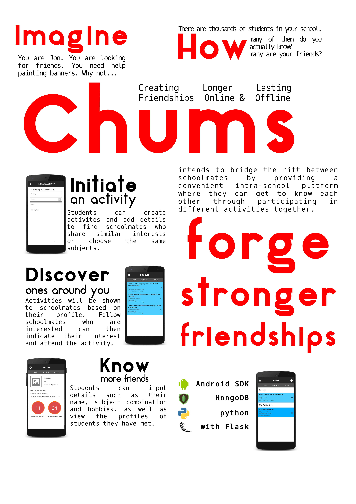

# chums

An Android application I built in 2016 for a hackathon which aims to connect students in the same school through activities, matching them based on their common interests. Built with Java, with Python Flask + MongoDB on the backend.

